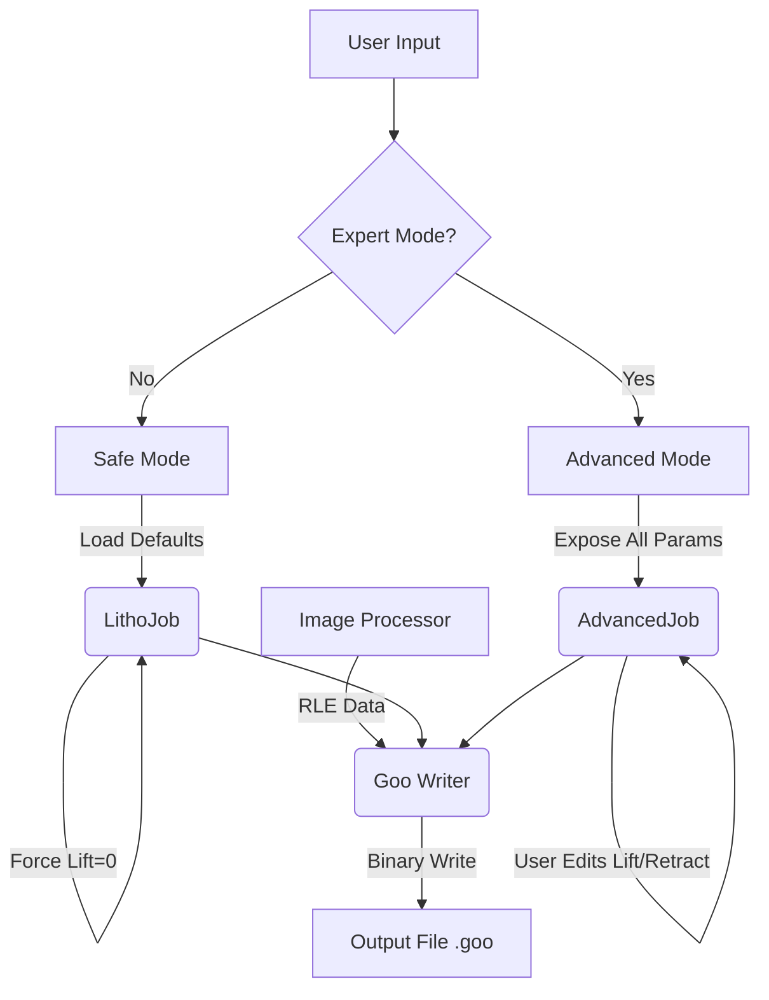

# GooLitho

**DLP Lithography Converter for ELEGOO Printers**

A specialized Python tool that repurposes ELEGOO resin 3D DLP printers (Mars 4 DLP) into DLP lithography machines. Convert single 2D images (SVG, PNG, JPEG) into valid `.goo` files for precise, single-exposure patterning on photoresist-coated substrates.

---

## 📋 Table of Contents

- [Overview](#overview)
- [Features](#features)
- [Installation](#installation)
- [Project Structure](#project-structure)
- [Architecture](#architecture)
- [Data Flow](#data-flow)

---

## Overview

GooLitho transforms standard ELEGOO DLP printers into precision lithography systems. Unlike traditional 3D slicers that generate thousands of layers, this tool processes a single 2D image and generates a `.goo` file containing exactly **one layer**—perfect for photolithography applications on PCBs, wafers, and MEMS devices.

### Key Capabilities

- **Single-Layer Generation**: Produces `.goo` files with exactly one exposure layer
- **Multi-Format Support**: Accepts SVG (vector), PNG, and JPEG images
- **Safety-First Design**: Default mode prevents mechanical damage to delicate substrates
- **Expert Mode**: Advanced control for researchers requiring custom parameters

---

## Features

### 🖼️ Image Processing
- **Multi-Format Input**: Accepts SVG (vector), PNG, and JPEG
- **Auto-Scaling**: Automatically resizes images to match printer resolution (e.g., 11520×5120 for Saturn 3)
- **Test Pattern Library**: Built-in calibration images (resolution stars, focus grids) for system tuning

### ⚙️ Configuration & Control
- **Preset Management**: Save and load exposure configurations (e.g., "SU-8 Photoresist 50um", "PCB Dry Film")
- **Exposure Control**: Precise control over Exposure Time (dose) and Z-Height (focus)
- **Preview Generation**: Generates required thumbnail previews for printer OS recognition

### 🛡️ Safety & Advanced Modes
- **Lithography Safety (Default)**: Hardcodes all lift/retract distances to 0mm to prevent mechanical damage
- **Expert Mode**: Toggleable advanced mode exposing raw `.goo` header parameters:
  - Lift Speeds
  - Retract Distances
  - PWM settings
  - Light-off delays
  - Custom behavior for specialized applications (e.g., Dip Coating Lithography)

---

## Installation

### Requirements

- Python 3.7+
- Dependencies: Pillow, svglib, numpy

### Setup

```bash
pip install -r requirements.txt
```

---

## Project Structure

```
GooLitho/
├── assets/
│   └── test_images/          # Calibration patterns (SVG/PNG) for debugging
├── config/
│   ├── printers.json         # Machine parameters database (Resolution, Build Volume)
│   └── defaults.py           # Default parameters (Magic tags, Header constants)
├── data/
│   └── presets/              # User-saved JSON files (full .goo header config)
├── core/
│   ├── advanced/             # Expert Mode logic
│   │   └── manual_override.py # Raw parameter injection, bypasses safety checks
│   ├── image_processor.py    # Resizing, thresholding, and mirroring
│   ├── rle_encoder.py        # ELEGOO RLE compression algorithm
│   └── goo_writer.py         # Assembles Header + Layer Block + Footer
├── models/
│   ├── printer_profile.py    # Dataclass for printer specifications
│   ├── litho_job.py          # Standard "Safe" lithography job dataclass
│   └── advanced_job.py       # Expert job dataclass (exposes 40+ .goo parameters)
├── ui/
│   ├── main_window.py        # Main GUI entry point
│   └── widgets/              # Reusable UI components (Image preview, Preset dropdown)
├── utils/
│   └── preview_gen.py        # Generates 116×116 and 290×290 preview thumbnails
├── main.py                   # Application entry point
├── requirements.txt          # Python dependencies
└── README.md                 # This file
```

---

## Architecture

### Assets & Data (`assets/`, `data/`)

**`assets/test_images/`**
- Contains calibration patterns: `resolution_star.svg`, `focus_grid.png`, `alignment_crosshairs.svg`

**`data/presets/`**
- Stores JSON files representing "Lithography Recipes"
- Contains all variable fields for `.goo` header:
  - Exposure Time
  - Light PWM
  - Z-Offset
  - Mirror Settings
- **Use Case**: Switch between different photoresists without re-entering parameters

### Configuration (`config/`)

**`printers.json`**
- Machine parameters database (fixed hardware specs)
- Example entry:
  ```json
  {
    "name": "Saturn 3 Ultra",
    "resolution": [11520, 5120],
    "mirror": [true, true]
  }
  ```

**`defaults.py`**
- Stores immutable default parameters:
  - Magic bytes (0x07...)
  - Version strings
  - Fixed delimiters

### Models (`models/`)

**`printer_profile.py`**
- Validates loaded printer JSON data
- Dataclass for printer specifications

**`litho_job.py`**
- Standard state object for safe lithography jobs
- Enforces safety logic (forces lift=0)

**`advanced_job.py`**
- Expert state object
- Maps 1-to-1 to the `.goo` file specification
- Allows setting:
  - Lift Distance
  - Retract Speed
  - All 40+ `.goo` parameters
- ⚠️ **Warning**: Only used when "Expert Mode" is enabled in UI

### Core Logic (`core/`)

**`image_processor.py`**
- Converts SVGs to raster format
- Resizes images to `printer.resolution_x × printer.resolution_y`
- Converts to 1-bit monochrome
- Applies X/Y mirroring based on printer profile

**`rle_encoder.py`**
- Implements the 4-mode Run-Length Encoding algorithm
- Critical for `.goo` file compression

**`advanced/manual_override.py`**
- Specialized builder for Expert Mode
- Bypasses hardcoded "0" values in standard writer
- Accepts dictionary of raw parameters
- Injects parameters directly into header/layer definition

**`goo_writer.py`**
- Main builder class for `.goo` file generation
- Accepts either `LithoJob` or `AdvancedJob`
- Serializes to binary `.goo` format

### User Interface (`ui/`)

**`main_window.py`**
- **Preset Manager**: Dropdown to load saved settings
- **Image Source**: Radio buttons for "Upload File" vs "Test Image"
- **Mode Toggle**: Checkbox to enable "Advanced/Expert Mode" (unlocks full parameter list)

### Inverse Lithography & Grayscale Support (Advanced)

- **Pixel Modulation**: Supports 8-bit grayscale input (0-255) to enable sub-pixel resolution via anti-aliasing
- **3D Micro-Structuring**: Enables "Grayscale Lithography" (variable cure depth) for fabricating microlenses and blazed gratings
- **Global Intensity Control**: Allows user modulation of the LED Matrix PWM (0-100%)

---

## Data Flow

The application processes user input through two distinct pipelines depending on the selected mode:



### Processing Steps

1. **Input Selection**: User chooses image source (file upload or test pattern)
2. **Mode Selection**: Safe mode (default) or Expert mode (advanced)
3. **Job Creation**: 
   - **Safe Mode**: Creates `LithoJob` with safety constraints (lift=0)
   - **Expert Mode**: Creates `AdvancedJob` with full parameter access
4. **Image Processing**: Image is resized, converted to monochrome, and mirrored
5. **Encoding**: Image data is compressed using RLE algorithm
6. **File Generation**: `GooWriter` assembles header, layer block, and footer
7. **Output**: Binary `.goo` file ready for printer

---

## License

[Add your license information here]

## Contributing

[Add contribution guidelines here]
